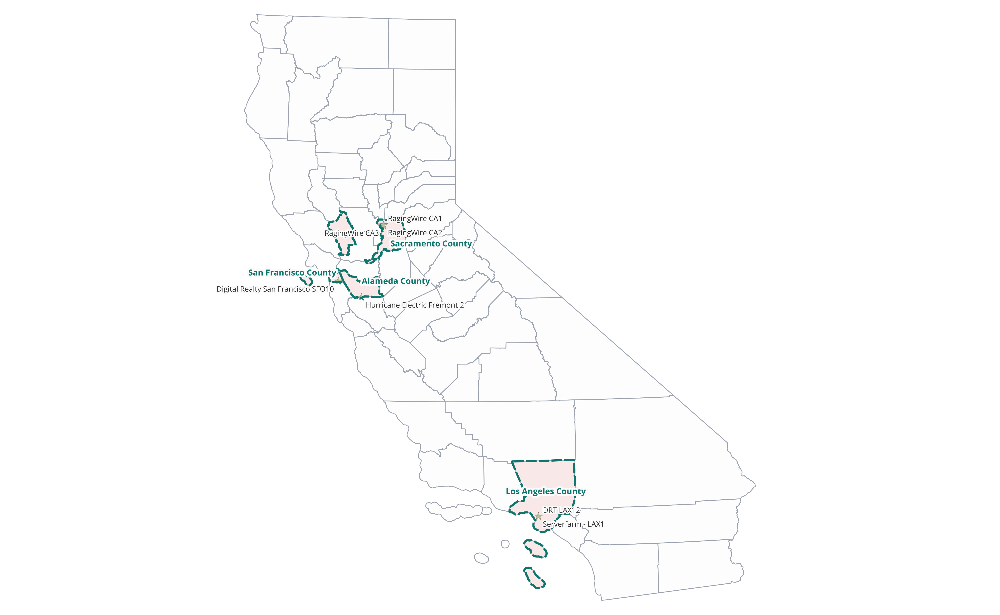
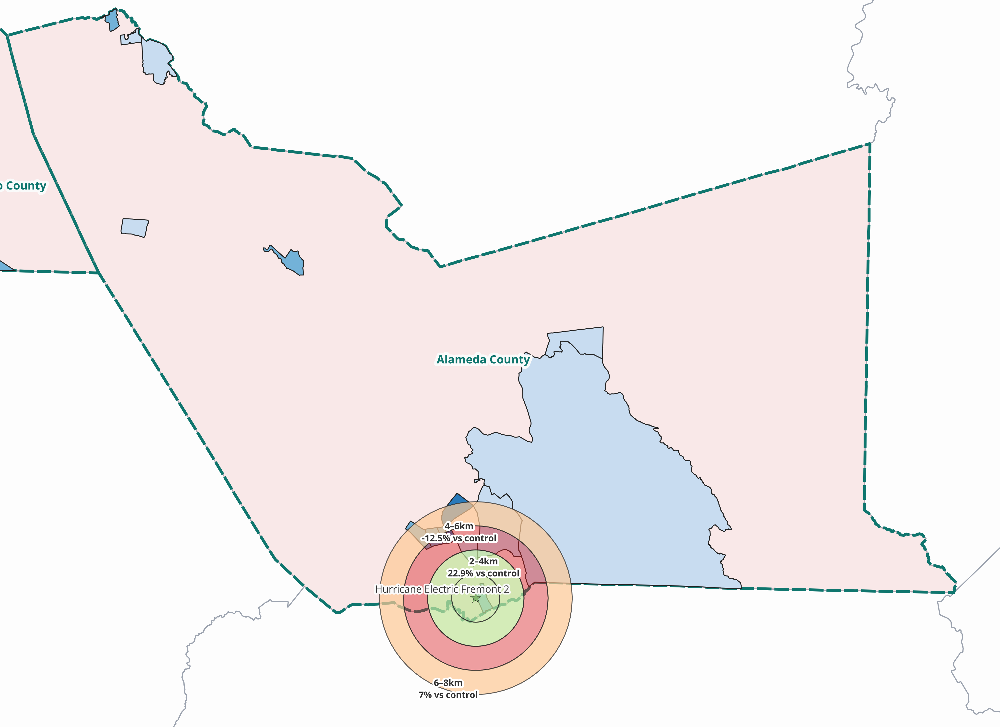
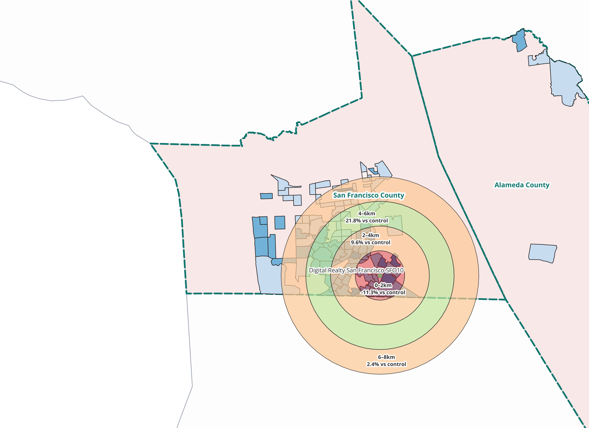
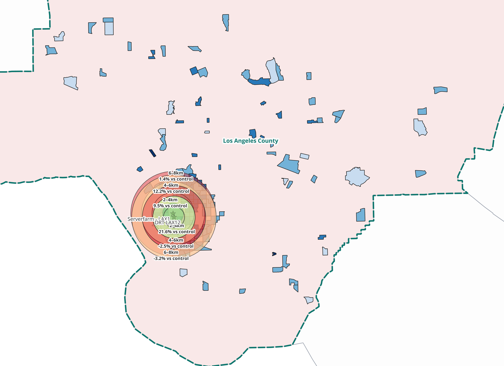
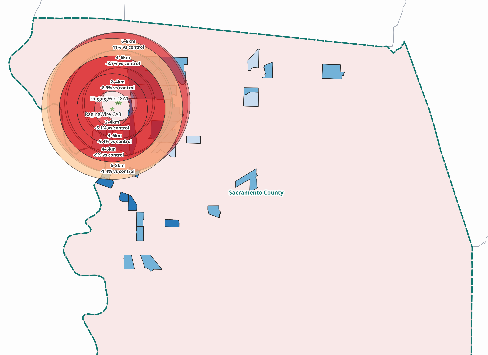
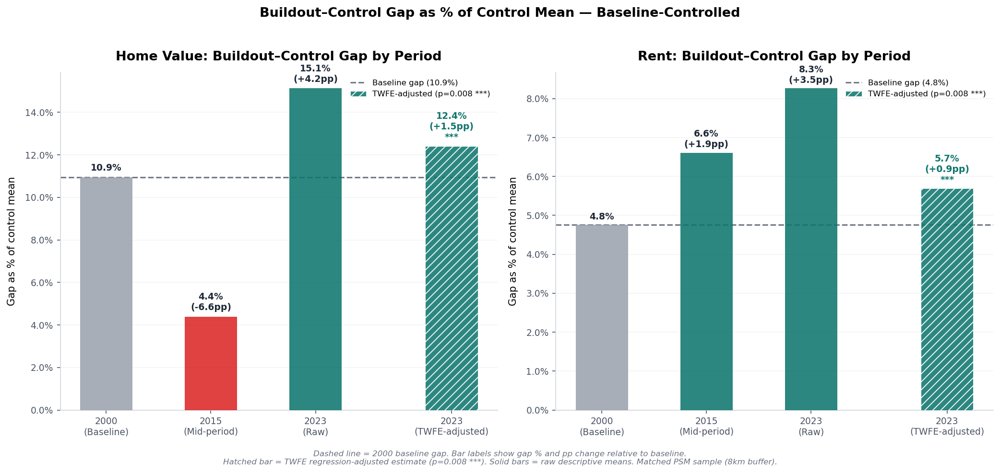
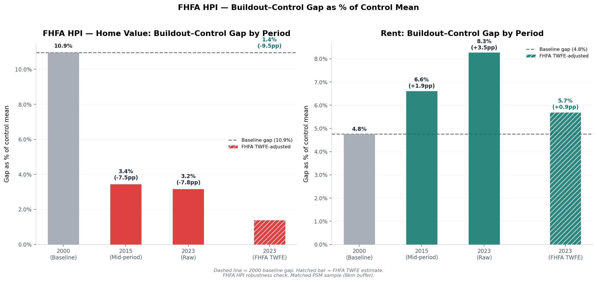

# Data Center Impacts on Home Values in California

## Abstract

This project will look at the impact Data Centers (DCs), larger than 100,000 sq ft, have in California, specifically their impacts on housing costs from the years 2000-2023. The focus on larger DCs is because with the new AI rush to build more large data centers, I wanted to examine how current large scale ones have effected local housing costs. This research will look at California counties with at least one DC over 100,000 square feet, and analyse the impacts on local housing markets. The counties will include Sacramento County, Los Angeles County, Alameda County, and San Francisco County. I am not including silicon valley/santa clara county due to the density of DCs larger than 100,000 sqft as its inclusion would dilute the results. 

This analysis will be done using both a Difference in Differences and Time/Tract fixed effects regression model (TWFE). The TWFE regression model will be used to control for all the time-invariant variables that effect home value and rent in all the tracts within a county, and then all the time-invarient variables effecting all the counties equally. THe equation being used is below:

    Model: Y_it = α_i + λ_t + β1(buildout × post2015) + β2(buildout × post2023) + ε_it

- Y = Either median home value median rent, dependent on what's being analysed. 

- Buildout = treatment tract (Tracts within 8km of a DC 100,000 sqft or larger) Binary variable(0 if control, 1 if treatment).

- post2015 and post2023 = time variables. Binary variable(0 if not the year, 1 if its 2015 for post2015, and 1 if its 2023 for post2023).

- α_i  = tract fixed effect (stable neighborhood characteristics).
- λ_t  = year fixed effect (statewide macro trends).

Below is a map of California with the counties being studied highlighted. You'll notice Napa County is highlighted along with the others already mentioned. That is because Napa also has a DC larger than 100,000 sqft, however, the 8km radious covered almost the entire portion of housed tracts within the county, so it was ommitted from the final study. 

## Inputs 

There were muliple datasets used in this project. 2015 and 2023 ACS 5-year data via census API, and 2000 NHGIS Census SF3a tract level CSV was used for the analysis of median home value and rent. A Census API Key must be requested and obtained in order to pull this data. ACS Census data is pulled in script 2, housing_data_pipeline.py, however 2000 NHGIS Census SF3a tract level data must be requested from NHGIS archived census data and saved in the documented file listed in NHGIS within script 2 for Census data, though I have the specific needed info in this repository. Script 2 also pulls in and automatically downloads Census TIGER files for the California tract boundaries. 

For actual sale data I used Federal Housing Finance Agency (FHFA) data. Specifically HPI_at_BDL_tract.csv downloaded from their website. It must be downloaded and placed in the correct folder reflected in the FHFA cache line in script 2 (FHFA version) 

For the data center informaiton, im3 open source data center atlas version 2026 was used for all DC locations and sizes. Independent research was done to get the opening dates for each of the filtered DCs being studied. 

## Scripts

There are twelve python scripts used in this research. Seven of them are used to analyze Census data, and five of them are used to to analyze FHFA data. The opening_year_lookup.py only needs to be ran once. Once done, the outputs will be used by both the Census and FHFA scripts. The FHFA scripts do the same thing as the Census scripts, but process the FHFA data instead. 

Run these scripts in the order listed below. When running FHFA scripts, you do not need to rerun opening year lookup script. 

### Dependencies Used

- Core Data Packages: pandas, numpy, geopandas, and shapely
- Statistics & Regression: linearmodels, statsmodels, scikit-learn, and scipy
- Visualation: matplotlib
- Data Access: requests

### Census Scripts

1. opening_year_lookup.py 

    Reads the im3 data center atlas and puts those that match the counties being researched, along with their size, into a table. There is a part in this script to manually add newer data centers as they are built in the future. The years data centers were built were manually researched, as that data is not in the atlas. 

2. housing_data_pipeline.py

    Fetches and reads housing data from 2015 and 2023 ACS 5-year data via Census API, and also reads 2000 NHGIS Census SF3a tract-level CSV (must be downloaded prior to running). You must have your own API key to fetch Census data and have the Api Key text file in the main project folder, and also input the key within the code where it asks for it. Once done, this script will build the primary geopackage for the remainder of the analysis 

3. assign_treatment_groups.py

    This script will run through the geopackage created in the above script and assign all census tracts to either a control or treatment group based on if they are within or outside the 8km buffer surrounding the DCs being studied. 

4. bias_reduction.py

    Runs propensity score matching within each study county being studied, then combines the matched samples into one panel for regression. This ensures that the tracts being compared in the treatment and control groups are as similar as possible to reduce selection bias.  

5. fixed_effects_regression.py

    Runs a Difference in Differences and Time/Entity fixed effects regressions on the matched panel from script 4. It does regressions for each individual county at buffer distances of 2km, 4km, 6km, and 8km, as well as pooled regressions combining all the treatment and control tracts. Main variable being looked at are median household income, median home value, and median rent. Regressions are done to estimate the effect of DC proximity on household value. 

6. visualize_results.py

    Generates eight figures/graphs from script 5's regression results. 

7. build_qgis_layers.py

    Builds GeoPackage layers for QGIS maps showing housing change by buffer ring around each studied DC. 

### FHFA Scripts

1. housing_data_pipeline_fhfa.py

2. assign_treatment_groups_fhfa.py

3. bias_reduction_fhfa.py

4. fixed_effects_regression_fhfa.py

5. visualize_results_fhfa.py

## Results 

### Key Findings 

- Census: The effect of DCs over the size of 100,000 sqft in each county is different, and not statistically significant, due to the small sample size.
- Census: Pooled together , median home value increased 1.5% more in treatment tracts between 2000 - 2023 than they would have if there was no treatment in that time. This is statistically significant at the 95% confidence interval. 
- Census: Pooled together, median rent increased .9% more in treatment tracts between 2000 - 2023 than they would have if there was no treatment in that time. This is statistically significant at the 95% confidence interval. 
- FHFA: Pooled together, conducting this analysis with FHFA data, median home value increased 9.5% less in treatment tracts between 2000 - 2023 than they would have if there was no treatment at that time. This is not statistically significant. 

The below maps showcase the effects of DCs 100,000 sqft or larger on median home value in each studied county, based on census data. The blue figures in the buffers are the treatment tracts, and the ones outside the buffer are control tracts. 

### Alameda County

As shown in the figure above, according to census data, between 2000 - 2023, median home value increased between 22.5% - 25% in census tracts between 0km - 4km from a 100,000 sqft DC compared to the control group. Median home value decreased by 12.5% between 4km - 6km compared to the control tracts, but between 6km - 8km increased by 7% compared to the control tracts.  

### San Francisco County

As shown in the figure above, according to census data, between 2000 - 2023, median home value decreased by 11.3% in census tracts between 0km - 2km from a 100,000 sqft DC compared to the control group. Median home value increased by 9.6% between 2km - 4km compared to the control tracts, but between 4km - 6km increased by 21% compared to the control tracts. Median home value then increased by just 2.4% between 6km - 8km. 

### Los Angeles County

Los Angeles county is difficult because the two large DCs are close to each other. Interpreting the results, between 0km - 4km median home value in treatment tracts increased between 9.5% - 21.6% compared to control tracts. 4km - 6km median home value was between -2.5% - 12.2%, and between 6km - 8km median home value changed by -5.2% - 1.4% when compared to the control tracts between 2000 - 2023. 

### Sacramento County

Sacramento county is difficult because the three large DCs are close to each other. Interpreting the results, between 0km - 4km median home value in treatment tracts decreased between -8.9% - -5.1% compared to control tracts. 4km - 6km median home value was between -8.9% - -9.4%, and between 6km - 8km median home value changed by -1.4% - 11% when compared to the control tracts between 2000 - 2023. 

### Difference in Differences Assessment 

#### Census

The above figure shows the % change in median home value and rent value for each year of study, as well as the TWFE adjusted value for 2023. As stated earlier, this figure shows the difference in differences assessment between the control and treatent group (buildout). For median home value, treatment tract's median home value increased by 1.5% more between 2000 - 2023 than they would if they were never within 8km of a DC over 100,000 sqft large. 

The figure also shows that median rent in tracts within 8km of a DC over 100,000 sqft large increased by .9% more between 2000 - 2023 than they would if a they were never within 8km of a DC over 100,000 sqft large. 

#### FHFA

The FHFA data is used as a robustness check as it is actual home sale data compared to the census which marks what homeowners think their home is valued at. The difference in differences assement in the figure above shows treatment tracts median home value actually increased by 9.5% less than they would have if they were never within 8km of a DC over 100,000 sqft large between 2000 - 2023. 

## Conclusion 

The different results between Census and FHFA data reflects the difference in percieved and actual value of homes within 8km of a DC 100,000 sqft or larger. While the results are varying and not all statistically significant, that does not mean they are not important or interesting. Pooling all the treatment tracts, individuals in California within 8km of a DC 100,000 sqft or larger believe their homes are valued higher than those outside the buffer, which is statistically significant. Reality is the contrast. While not statistically significant at the 95% confidence interval, FHFA data reflects that between 2000 - 2023, actual median home values within 8k of a DC 100,000 sqft or larger grew slower than those outside the 8km radius. The difference between percieved and actual median home value is interesting and worth more research. Moving forward, and as more data centers are built, research must include a higher sample size of DCs, include more counties, and include other data sets that track home sales as robustness checks. 

## Statistical Acknolwedgments

The time/tract fixed effects model was used to control for all time-invariant variables effecting the tracts within a county, and those effecting all counties equally. With that said, it could not control, when pooled, the difference between the counties, and it must be assumed that the housing trends in each county was the same prior to the treatment being reviewed. While the TFWE regression controlled time-invarient variables, it could not control for other time-varient variables such as housing market, number of sales, and other unobserved variables that effect housing value in a county. 

## References and Notes 

NHGIS Data Citation:

Jonathan Schroeder, David Van Riper, Steven Manson, Katherine Knowles, Tracy Kugler, Finn Roberts, and Steven Ruggles. IPUMS National Historical Geographic Information System: Version 20.0 [dataset]. Minneapolis, MN: IPUMS. 2025. http://doi.org/10.18128/D050.V20.0

The DC CSV discusses sq footage in whitespace available, not actual size of the building  

## AI Acknowledgement 

I used Claude AI to assist with the creation of all the code used in this project. All research, assessment plans, regression methods, analysis, and maps were created by myself. The writting of this report was all done by myself. 